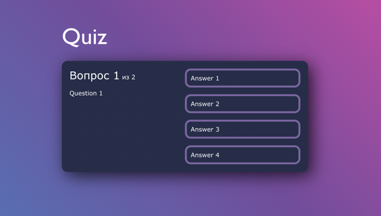

## Quiz App



### Build docker image
```bash
docker build -t quiz-app:0.0.1 .
```


### Start container
```bash
docker run -d --name quiz-app --restart=always \
           -p 5000:5000 quiz-app:0.0.1
```
